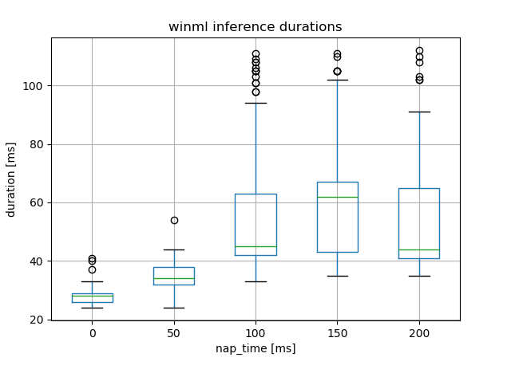
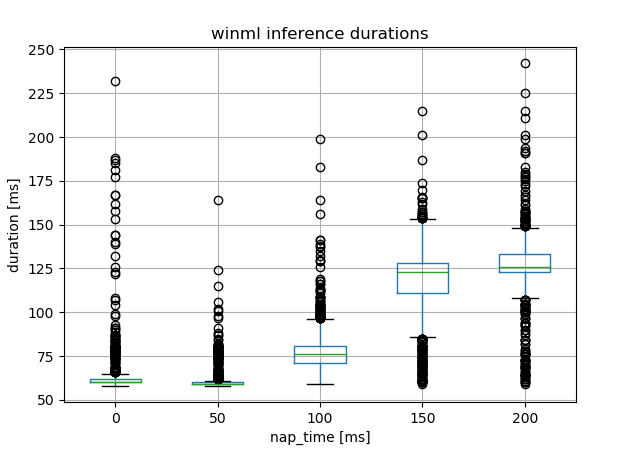

# WinML inference time

## Problem statement

It seems that WinML inference duration is correlated with the frequency with which it is called. The more frequent called the faster it is.

## Experiment

This repository contains a simple application which calls in a loop the WinML-based inference with various sleep times between iterations (`0ms`, `50ms`, `100ms`, `150ms`, `200ms`) and records the computed durations in a text file (`winml_durations.txt`). The ONNX model shall be provided as a first command line argument. The model's input is randomly generated, the output is retrieved and ignored. The application at startup enumerates available GPU devices in order to determine whether inference should be run on GPU (DirectX) or CPU (default), if there is no GPU device available. There is also a simple python script [visualize_durations.py](visualize_durations.py) visualizing the collected durations.

### Running the app

 * Open Visual Studio and load the [winml_inference_time.sln](winml_inference_time.sln) solution.
 * Build the solution in the `Release` mode for your architecture
 * Run the generated `winml_inference_time.exe` providing path to the ONNX model as the command line argument, for instance use the [yolov2-coco-9.onnx](https://github.com/onnx/models/blob/master/vision/object_detection_segmentation/yolov2-coco/model/yolov2-coco-9.onnx) model, i.e.:
```
$ ./x64/Release/winml_inference_time.exe ~/Downloads/yolov2-coco-9.onnx
Using model C:/Users/tomaszmi/Downloads/yolov2-coco-9.onnx
GPU device: description: NVIDIA GeForce GTX 1050, type: default, vendor_id: 4318, device_id: 7297, dedicated_video_memory: 2073419776, dedicated_system_memory: 0, shared_system_memory: 17159557120
GPU device: description: NVIDIA GeForce GTX 1050, type: high performance, vendor_id: 4318, device_id: 7297, dedicated_video_memory: 2073419776, dedicated_system_memory: 0, shared_system_memory: 17159557120
GPU device: description: NVIDIA GeForce GTX 1050, type: minimum power, vendor_id: 4318, device_id: 7297, dedicated_video_memory: 2073419776, dedicated_system_memory: 0, shared_system_memory: 17159557120
Running 1000 inference iterations with 0 [ms] sleep in between
Running 1000 inference iterations with 50 [ms] sleep in between
Running 1000 inference iterations with 100 [ms] sleep in between
Running 1000 inference iterations with 150 [ms] sleep in between
Running 1000 inference iterations with 200 [ms] sleep in between
The inference durations have been saved in ./winml_durations.txt
Run `python ./winml_durations.txt` to visualize the results
$
```

The inference durations are stored to the `winml_durations.txt` file, generated in the directory the app has been run from. In order to visualize the collected results run the [visualize_durations.py](visualize_durations.py) script:

```
$ ~/Anaconda3/python visualize_durations.py winml_durations.txt
```

### Results for GPU based inference



```
         inference_dur
                   min  max    mean        std
nap_time
0                   24   41  27.704   2.028423
50                  24   54  34.514   3.351572
100                 33  111  50.904  12.513328
150                 35  111  56.126  13.421634
200                 35  112  50.826  13.448516
```

### Results for CPU based inference



```
         inference_dur
                   min  max    mean        std
nap_time
0                   58  232   64.300  15.158489
50                  58  164   61.450   7.103095
100                 59  199   78.080  13.114327
150                 59  215  117.586  21.325135
200                 59  242  126.455  18.949012
```

## Environment

Produced results have been generated by running the app on the following hardware and OS version:
```
$ systeminfo

Host Name:                 DESKTOP-BD53OPF
OS Name:                   Microsoft Windows 10 Home
OS Version:                10.0.21364 N/A Build 21364
OS Manufacturer:           Microsoft Corporation
OS Configuration:          Standalone Workstation
OS Build Type:             Multiprocessor Free
Registered Owner:          Użytkownik systemu Windows
Registered Organization:
Product ID:                00326-00765-00000-AAOEM
Original Install Date:     24/04/2021, 00:27:45
System Boot Time:          24/04/2021, 00:23:54
System Manufacturer:       MSI
System Model:              MS-7A68
System Type:               x64-based PC
Processor(s):              1 Processor(s) Installed.
                           [01]: Intel64 Family 6 Model 158 Stepping 9 GenuineIntel ~4200 Mhz
BIOS Version:              American Megatrends Inc. 1.00, 15/12/2016
Windows Directory:         C:\WINDOWS
System Directory:          C:\WINDOWS\system32
Boot Device:               \Device\HarddiskVolume2
System Locale:             pl;Polish
Input Locale:              pl;Polish
Time Zone:                 (UTC+01:00) Sarajevo, Skopje, Warsaw, Zagreb
Total Physical Memory:     32,729 MB
Available Physical Memory: 20,372 MB
Virtual Memory: Max Size:  37,593 MB
Virtual Memory: Available: 20,068 MB
Virtual Memory: In Use:    17,525 MB
Page File Location(s):     C:\pagefile.sys
Domain:                    WORKGROUP
Logon Server:              \\DESKTOP-BD53OPF
Hotfix(s):                 3 Hotfix(s) Installed.
                           [01]: KB5003252
                           [02]: KB5003401
                           [03]: KB5003397
Network Card(s):           3 NIC(s) Installed.
                           [01]: Intel(R) Ethernet Connection (2) I219-V
                                 Connection Name: Ethernet
                                 Status:          Media disconnected
                           [02]: VirtualBox Host-Only Ethernet Adapter
                                 Connection Name: VirtualBox Host-Only Network
                                 DHCP Enabled:    No
                                 IP address(es)
                                 [01]: 192.168.56.1
                                 [02]: fe80::edd3:1d42:b651:a883
                           [03]: ASUS PCE-AC68 802.11ac Network Adapter
                                 Connection Name: Wi-Fi 3
                                 DHCP Enabled:    Yes
                                 DHCP Server:     192.168.1.1
                                 IP address(es)
                                 [01]: 192.168.1.108
                                 [02]: fe80::a974:ee60:aadf:5a32
Hyper-V Requirements:      A hypervisor has been detected. Features required for Hyper-V will not be displayed.


$ /c/Program\ Files/NVIDIA\ Corporation/NVSMI/nvidia-smi.exe
Mon Apr 26 11:52:33 2021
+-----------------------------------------------------------------------------+
| NVIDIA-SMI 461.92       Driver Version: 461.92       CUDA Version: 11.2     |
|-------------------------------+----------------------+----------------------+
| GPU  Name            TCC/WDDM | Bus-Id        Disp.A | Volatile Uncorr. ECC |
| Fan  Temp  Perf  Pwr:Usage/Cap|         Memory-Usage | GPU-Util  Compute M. |
|                               |                      |               MIG M. |
|===============================+======================+======================|
|   0  GeForce GTX 1050   WDDM  | 00000000:01:00.0  On |                  N/A |
|  0%   45C    P8    N/A / 120W |   1334MiB /  2048MiB |      2%      Default |
|                               |                      |                  N/A |
+-------------------------------+----------------------+----------------------+


DxDiag:
------------------
System Information
------------------
      Time of this report: 4/26/2021, 11:53:13
             Machine name: DESKTOP-BD53OPF
               Machine Id: {A8A05BD1-96E3-4508-9E09-CB732218C1D9}
         Operating System: Windows 10 Home 64-bit (10.0, Build 21364) (21364.co_release.210416-1504)
                 Language: English (Regional Setting: English)
      System Manufacturer: MSI
             System Model: MS-7A68
                     BIOS: 1.00 (type: UEFI)
                Processor: Intel(R) Core(TM) i7-7700K CPU @ 4.20GHz (8 CPUs), ~4.2GHz
                   Memory: 32768MB RAM
      Available OS Memory: 32730MB RAM
                Page File: 17516MB used, 20077MB available
              Windows Dir: C:\WINDOWS
          DirectX Version: DirectX 12
      DX Setup Parameters: Not found
         User DPI Setting: 168 DPI (175 percent)
       System DPI Setting: 144 DPI (150 percent)
          DWM DPI Scaling: Enabled
                 Miracast: Available, with HDCP
Microsoft Graphics Hybrid: Not Supported
 DirectX Database Version: 1.1.9
           DxDiag Version: 10.00.21364.0001 64bit Unicode

---------------
Display Devices
---------------
           Card name: NVIDIA GeForce GTX 1050
        Manufacturer: NVIDIA
           Chip type: GeForce GTX 1050
            DAC type: Integrated RAMDAC
         Device Type: Full Device (POST)
          Device Key: Enum\PCI\VEN_10DE&DEV_1C81&SUBSYS_372C1458&REV_A1
       Device Status: 0180200A [DN_DRIVER_LOADED|DN_STARTED|DN_DISABLEABLE|DN_NT_ENUMERATOR|DN_NT_DRIVER] 
 Device Problem Code: No Problem
 Driver Problem Code: Unknown
      Display Memory: 18341 MB
    Dedicated Memory: 1977 MB
       Shared Memory: 16364 MB
        Current Mode: 3840 x 2160 (32 bit) (60Hz)
         HDR Support: Not Supported
    Display Topology: Internal
 Display Color Space: DXGI_COLOR_SPACE_RGB_FULL_G22_NONE_P709
     Color Primaries: Red(0.639648,0.330078), Green(0.299805,0.599609), Blue(0.149414,0.059570), White Point(0.312500,0.329102)
   Display Luminance: Min Luminance = 0.500000, Max Luminance = 270.000000, MaxFullFrameLuminance = 270.000000
        Monitor Name: Generic PnP Monitor
       Monitor Model: DELL U2718Q
          Monitor Id: DELA0EC
         Native Mode: 3840 x 2160(p) (59.997Hz)
         Output Type: Displayport External
Monitor Capabilities: HDR Not Supported
Display Pixel Format: DISPLAYCONFIG_PIXELFORMAT_32BPP
      Advanced Color: Not Supported
         Driver Name: C:\WINDOWS\System32\DriverStore\FileRepository\nv_dispsi.inf_amd64_396e5cc638c49622\nvldumdx.dll,C:\WINDOWS\System32\DriverStore\FileRepository\nv_dispsi.inf_amd64_396e5cc638c49622\nvldumdx.dll,C:\WINDOWS\System32\DriverStore\FileRepository\nv_dispsi.inf_amd64_396e5cc638c49622\nvldumdx.dll,C:\WINDOWS\System32\DriverStore\FileRepository\nv_dispsi.inf_amd64_396e5cc638c49622\nvldumdx.dll
 Driver File Version: 27.21.0014.6192 (English)
      Driver Version: 27.21.14.6192
         DDI Version: 12
      Feature Levels: 12_1,12_0,11_1,11_0,10_1,10_0,9_3,9_2,9_1
        Driver Model: WDDM 2.7
 Hardware Scheduling: DriverSupportState:Stable Enabled:False 
 Graphics Preemption: Pixel
  Compute Preemption: Dispatch
            Miracast: Not Supported
      Detachable GPU: No
 Hybrid Graphics GPU: Not Supported
      Power P-states: Not Supported
      Virtualization: Paravirtualization 
          Block List: No Blocks
  Catalog Attributes: Universal:False Declarative:False 
   Driver Attributes: Final Retail
    Driver Date/Size: 11/03/2021 02:00:00, 1049064 bytes
         WHQL Logo'd: n/a
     WHQL Date Stamp: n/a
   Device Identifier: {D7B71E3E-5FC1-11CF-D86F-22171BC2D635}
           Vendor ID: 0x10DE
           Device ID: 0x1C81
           SubSys ID: 0x372C1458
         Revision ID: 0x00A1
  Driver Strong Name: oem42.inf:0f066de3900d3b82:Section090:27.21.14.6192:pci\ven_10de&dev_1c81
      Rank Of Driver: 00D12001
```


